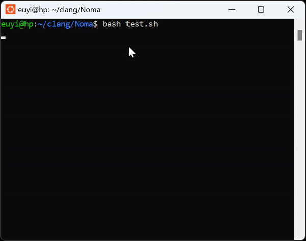

# Noma-Phonebook

A non-GUI Phonebook Program written in CPP.

## What?
`Noma Phonebook` is a Program I built in CPP solely for Practical Purposes. 

The goal was to practice adherence to the current Inductry Rules and Guidelines for the use of C++17 in critical systems.

The GIF image below shows the Action of some basic Commands supported by the Program.

	

